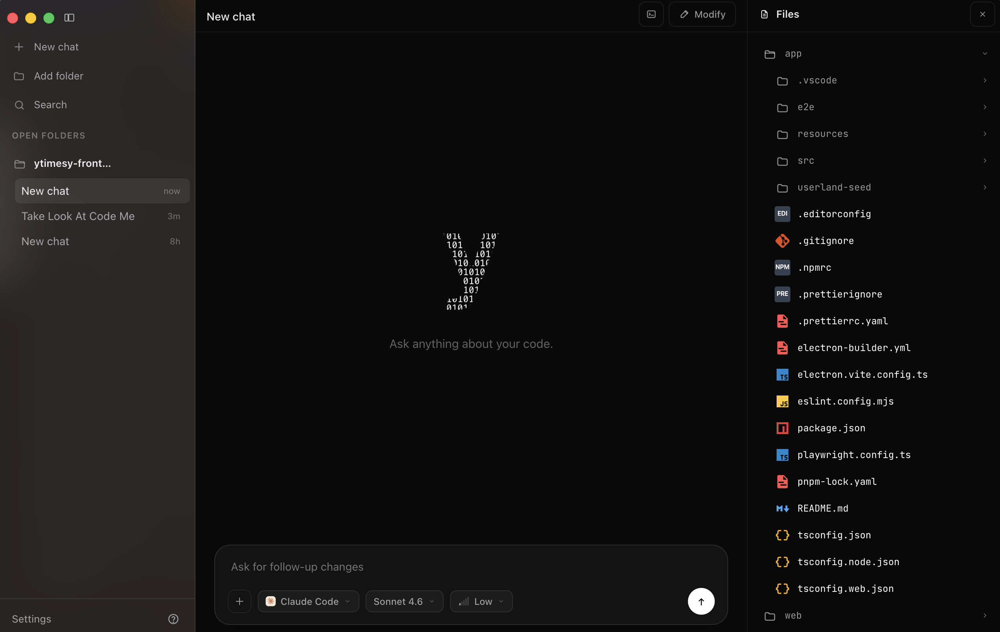

# y

<p align="center">
  
</p>

https://github.com/user-attachments/assets/24f10277-bb0e-4c3f-8a05-6833363d07a2

<p align="center">
  <a href="https://github.com/y-times-y/y/releases/latest/download/y-0.0.1.dmg">
    
  </a>
</p>

**y** is a malleable desktop coding-agent app.

It is built around a simple idea: software should become malleable while you use it. The main interface is a chat, but the app can reshape its own UI through a protected Modify surface. You can ask y to change how y itself works, keep the change if it renders safely, or roll it back if it does not.

y is not a new agent model. It is a local, chat-first workspace for the coding agents you already use: Claude Code, OpenAI Codex, and other CLI-native agents over time.

## Things to try

- Run Claude Code and Codex side by side from one desktop app.
- Start separate chats in isolated workspaces so agents can work in parallel without touching the same checkout.
- Ask Modify to change y's interface live, then review the generated diff before keeping it.
- Add or adjust app UI controls, layout, copy, and local workflow affordances through Modify.
- Open the file tree, terminal, and diff views while an agent is working.
- Revert a Modify change if the new UI is not what you wanted.

## What Modify is

Modify is the part of y that edits y itself. It is a separate chat focused on changing the app interface, not your project code. The change still goes through code and diff review: Modify edits the local Userland UI, y renders it, and you choose whether to keep or revert it.

Modify is not meant to control the protected app core. It should not get access to auth/session internals, analytics controls, privileged host APIs, or the Modify system itself. Those boundaries live in the protected Kernel.

## Why y exists

Most coding-agent apps are fixed products. You can use them, configure them, maybe install plugins, but the product itself still belongs to someone else.

y is different. It treats the app as malleable software:

- **Chat first.** The default surface is a focused conversation, not an editor clone.
- **Self-modifying.** The Modify rail can edit the live Userland UI while the protected Kernel stays locked.
- **Local agents.** Claude Code and Codex run as official local CLIs with the user's own login.
- **Parallel work.** Chats can use isolated workspaces so agents can work in parallel without stepping on the same files.
- **Diff-gated changes.** UI changes compile, render, show a diff, and can be kept or discarded.
- **Rollback built in.** The app keeps known-good snapshots so broken UI changes can recover.

## How it works

y is split into two parts:

| Layer | What it does |
| --- | --- |
| **Protected Kernel** | Auth, local engine adapters, app state, safety rails, filesystem boundaries, terminal bridge, Modify rail, and rollback runway. |
| **Mutable Userland** | The chat UI and app surface that can be edited live by the user or by Modify. |

This split lets y feel self-modifying without giving the modification agent control over the protected core. The app can change its own interface, but the Kernel still owns the trust boundaries.

## Claude Code and Codex

y runs coding agents locally instead of proxying them through a hosted account.

- **Claude Code** uses the official Claude Code CLI.
- **Codex** uses the official Codex CLI.
- Model and effort settings stay visible in the composer.
- Multiple chats can run against different engines.
- Isolated workspaces let parallel agents work without interfering with each other.

The user's local CLI auth remains the source of truth. y orchestrates the experience; it does not replace the agent providers.

## Download

The latest macOS build is published on GitHub Releases:

<p>
  <a href="https://github.com/y-times-y/y/releases/latest/download/y-0.0.1.dmg">
    
  </a>
</p>

Current release target: **macOS Apple Silicon**.

## Development

```bash
cd app
pnpm install
pnpm dev
```

Useful checks:

```bash
pnpm typecheck
pnpm test:ui
```

Build a local macOS bundle:

```bash
pnpm build:mac
```

The generated app artifacts are written to `app/dist/` and are intentionally not committed.

## Privacy and analytics

y keeps the coding workflow local. Project files, terminal commands, chat contents, and agent prompts are not collected or stored by y, and they are not sent to y's product analytics.

"Local" means Claude Code and Codex run on the user's machine through their official CLIs. y still uses login for account-based product features and basic app usage analytics.

Product analytics are for app usage health: sign-in state, feature usage, feedback, and missing-brick requests. Missing-brick reports are structured and should describe the missing capability, not the user's private prompt or source code.

## Status

y is under active development. The current focus is launch-readiness for macOS: packaging, auth, analytics, local app-state durability, and the self-modifying Modify workflow.

## License

MIT. See [LICENSE](LICENSE).
